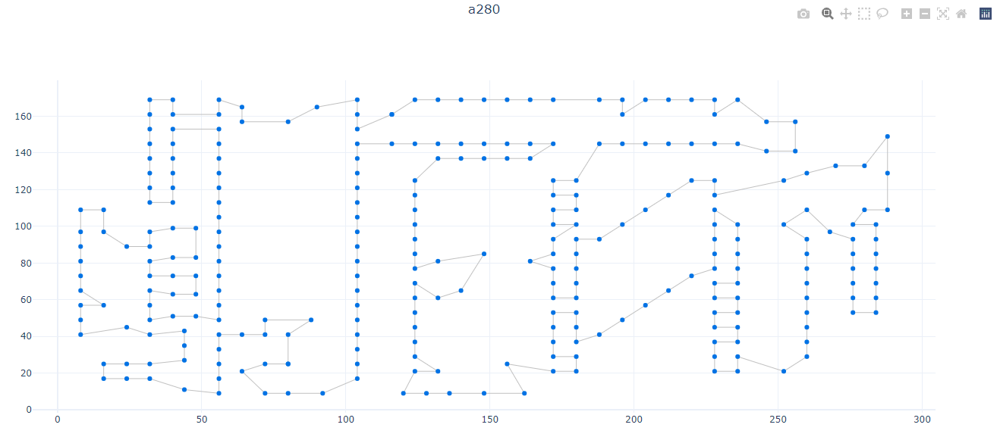

# Lin-Kernighan Heuristic in Python

This package contains the implementation of *Lin-Kernighan Heuristic* as the main solver for Travelling Salesman Problem (**TSP**) instances. Installation can be made via the pip command:

```
pip install lk_heuristic
```

## Implementation Remarks

### LK and LKH

LK Heuristic was first reported in an [1973 article][lk_article], where the core basis of the algorithm is well explained and detailed. A few decades later, in an [1998 article][lkh_article], Keld Helsgaun reported some enhancements to the original LK Heuristic (the famous [LKH heuristic][lkh]) with additional technical details for implementing the LK heuristic.

Both of these articles were the foundation for the implementation of the algorithm included in this package, with additional inspiration from [Arthur Mahéo post][arthur] / python implementation (which I strongly recommend the reading!).

### Node Structure

Nodes are implemented as Doubly-Linked Lists, one of the structures mentioned by Helsgaun to speed up edge swap operations. More advanced structures can be implemented for faster swaps, but are not included in this package.

### Refinements

There are 4 refinements proposed in the 1973 article aiming to improve the algorithm performance, which were implemented in this packages:

 1. Avoid checkout time (by skipping repeated 'bad' tours).
 2. Lookahead (by selecting 'good' edges for swaps)
 3. Reduction (by keeping 'good' edges from being broken)
 4. Non-Sequential exchanges (by executing the double-bridge 4-Opt move)
 
## How-to-use

### TSPLIB

The use of this package is based on [.tsp files][tsplib] as the input to the improve procedure and also as the output (with the difference that nodes will be sorted at output file). Currently the .tsp files supported are *"TYPE: TSP"* (i.e, symmetric problem) and *"EDGE_WEIGHT_TYPE: EUC_2D / EUC_3D"* (euclidean distance in 2D or 3D), with no "special" sections in .tsp file. 

### Solvers

The package contains 4 possible solvers for the TSP problem, which can be selected during interactive mode or silent mode:

  1. **Brute-Force**: test all tour possibilities (this should be used for very small problems)
  2. **Nearest-Neighbor**: collect nearest nodes starting from a random node (fast, but non-optimal)
  3. **Lin-Kernighan 1**: LK algorithm inspired by the original LK Paper
  4. **Lin-Kernighan 2**: LK algorithm inspired by Helsgaum LK-simplification and Arthur Mahéo python implementation 

Methods 1 and 2 were implemented mostly for testing reasons and some performance comparisons, so the recommended solver is Lin-Kernighan.

### Interactive Mode

Interactive mode will ask users to select the input file and a solver function, when no args are supplied to the solve function, like shown in the sample code below:

``` 
from lk_heuristic.utils.solver_funcs import solve
solve()
```

### Silent Mode

In silent mode all args are passed to the solve function so that no interaction is required through the shell, like shown in the sample code below:

```
from lk_heuristic.utils.solver_funcs import solve
solve(tsp_file="C:/temp/test.tsp", solution_method="lk1_improve", runs=50, logging_level=20)
```

### Example of an interactive run 

```
# Step 1 - TSP Instance Selection #
*TSP instances avaliable in 'samples' directory:
[0] - a280.tsp
[1] - att48.tsp
[2] - hexagon_2d.tsp
[3] - hexagon_3d.tsp
--> Select one of the instances: 2

# Step 2 - TSP Solution Methods #
*TSP solution methods avaliable in tsp.py:
[0] - bf_improve
[1] - nn_improve
[2] - lk1_improve
[3] - lk2_improve
--> Select one of the solution methods: 2

2022-04-26 19:32:02,850 [INFO] lk_heuristic.utils.solver_funcs: Importing .tsp file 'hexagon_2d.tsp'
2022-04-26 19:32:02,853 [INFO] lk_heuristic.utils.solver_funcs: Using 'euc_2d' for edge type 'EUC_2D'
2022-04-26 19:32:02,854 [INFO] lk_heuristic.utils.solver_funcs: Creating TSP instance
2022-04-26 19:32:02,859 [INFO] lk_heuristic.utils.solver_funcs: Starting improve loop
2022-04-26 19:32:02,861 [DEBUG] lk_heuristic.models.tsp: Starting tour cost: 214.996
2022-04-26 19:32:02,862 [DEBUG] lk_heuristic.models.tsp: Current tour '1' cost: 167.055 / gain: 47.942 / swaps: 1 / feasible swaps: 1 / unfeasible swaps: 0
2022-04-26 19:32:02,864 [DEBUG] lk_heuristic.models.tsp: Current tour '2' cost: 152.913 / gain: 14.142 / swaps: 2 / feasible swaps: 0 / unfeasible swaps: 2
2022-04-26 19:32:02,866 [DEBUG] lk_heuristic.models.tsp: Current tour '3' cost: 123.071 / gain: 29.841 / swaps: 2 / feasible swaps: 2 / unfeasible swaps: 0
2022-04-26 19:32:02,870 [DEBUG] lk_heuristic.models.tsp: Current tour '4' cost: 100.711 / gain: 22.361 / swaps: 2 / feasible swaps: 2 / unfeasible swaps: 0
2022-04-26 19:32:02,874 [DEBUG] lk_heuristic.models.tsp: Current tour '5' cost: 100.711 / gain: 0.000 / swaps: 0 / feasible swaps: 0 / unfeasible swaps: 0
2022-04-26 19:32:02,875 [INFO] lk_heuristic.utils.solver_funcs: [Run:1] --> Cost: 100.711 / Best: 100.711 / Mean: 100.711 (0.014s)
2022-04-26 19:32:02,876 [INFO] lk_heuristic.utils.solver_funcs: Exporting 'hexagon_2d_100.711.tsp' file to solutions 
folder
```

### Example of a silent run 

```
2022-04-26 19:35:41,423 [INFO] lk_heuristic.utils.solver_funcs: Importing .tsp file 'test.tsp'
2022-04-26 19:35:41,424 [INFO] lk_heuristic.utils.solver_funcs: Using 'euc_2d' for edge type 'EUC_2D'
2022-04-26 19:35:41,425 [INFO] lk_heuristic.utils.solver_funcs: Creating TSP instance
2022-04-26 19:35:41,426 [INFO] lk_heuristic.utils.solver_funcs: Starting improve loop
2022-04-26 19:35:41,431 [INFO] lk_heuristic.utils.solver_funcs: [Run:1] --> Cost: 100.711 / Best: 100.711 / Mean: 100.711 (0.005s)
2022-04-26 19:35:41,441 [INFO] lk_heuristic.utils.solver_funcs: [Run:2] --> Cost: 100.711 / Best: 100.711 / Mean: 100.711 (0.009s)
2022-04-26 19:35:41,445 [INFO] lk_heuristic.utils.solver_funcs: [Run:3] --> Cost: 100.711 / Best: 100.711 / Mean: 100.711 (0.003s)
2022-04-26 19:35:41,450 [INFO] lk_heuristic.utils.solver_funcs: [Run:4] --> Cost: 100.711 / Best: 100.711 / Mean: 100.711 (0.004s)
2022-04-26 19:35:41,455 [INFO] lk_heuristic.utils.solver_funcs: [Run:5] --> Cost: 100.711 / Best: 100.711 / Mean: 100.711 (0.004s)
2022-04-26 19:35:41,456 [INFO] lk_heuristic.utils.solver_funcs: Exporting 'test_100.711.tsp' file to solutions folder
```

## Plotting

The main output from the improvement process is the .tsp file with nodes sorted as in the optimal tour found at improvement procedure. User can use this file and parse it to his preferred visualization tool. Although, a simple tool was designed to display 2D and 3D plots using [Plotly][plotly].

In plot_funcs.py, there are two functions to plot either 2D or 3D graphs using as input the .tsp file. After running those functions, a html file is exported at 'plots' folder, which can be viewed using the browser.

```
from lk_heuristic.utils.plot_funcs import plot_tsp_2d
plot_tsp_2d("src/lk_heuristic/solutions/a280_2593.558.tsp")
```

Example of the plot result using a280.tsp instance


## Packages and Versions

- OS: Windows 10
- Python: 3.7.0 64bit
- Additional Packages: plotly==5.5.0 

[lk_article]: https://doi.org/10.1287%2Fopre.21.2.498
[lkh_article]: https://doi.org/10.1016%2FS0377-2217%2899%2900284-2
[lkh]: http://webhotel4.ruc.dk/~keld/research/LKH/
[arthur]: https://arthur.maheo.net/implementing-lin-kernighan-in-python/
[tsplib]: http://comopt.ifi.uni-heidelberg.de/software/TSPLIB95/
[plotly]: https://plotly.com/python/